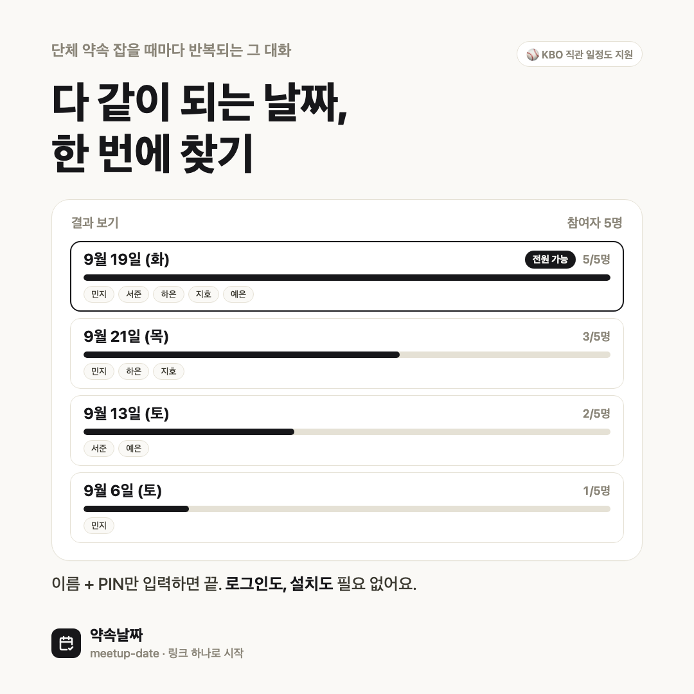
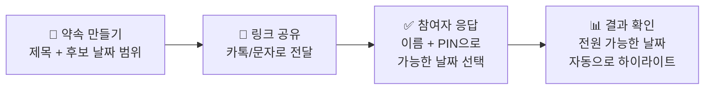

# meetup-date

여러 명이 가능한 날짜를 모아 겹치는 날짜를 자동으로 찾아주는 약속 조율 앱. Next.js + Prisma 7 + Supabase Postgres 기반. 로그인 없이 링크 공유만으로 참여할 수 있다.



## 사용 방법



1. **약속 만들기** — [meetup-date](.)에서 제목과 후보 날짜 범위를 정한다.
2. **링크 공유** — 생성되면 바로 공유 링크가 나온다. 복사하거나 카톡 등으로 바로 공유.
3. **참여자 응답** — 참여자는 로그인 없이 이름 + 4자리 PIN만 입력하고 캘린더에서 가능한 날짜를 고른다. 같은 이름+PIN으로 다시 들어오면 응답을 수정할 수 있다.
4. **결과 확인** — 날짜별로 몇 명이 가능한지 한눈에 보여주고, 전원 가능한 날짜는 자동으로 하이라이트된다.

응답 마감기한이나 최대 인원을 넘기면 결과 보기가 기본으로 뜨고, 약속 날짜가 끝난 지 14일이 지나면 데이터는 자동으로 삭제된다.

## 주요 기능

- **방(이벤트) 생성**: 제목, 설명, 후보 날짜 범위, 응답 마감기한(선택)
  - 범위 안에서 특정 요일만 후보로 남기는 요일 필터(전체/주중만/주말만/개별 요일) 지원
- **링크 공유**: 복사 버튼 + Web Share API(모바일에서 카톡 등 공유 시트로 연결)
  - 공유 시 카톡/슬랙 등 미리보기에 제목, 설명, 후보 날짜, 마감일자가 뜨도록 Open Graph/Twitter 메타데이터 설정
- **참가자 응답**: 이름 + PIN(4자리)으로 로그인 없이 참여, 같은 이름+PIN으로 재방문 시 수정 가능
  - 캘린더에서 날짜를 하나씩 선택하거나, 전체선택/요일별 일괄 선택(예: "토" 누르면 후보에 포함된 모든 토요일이 한 번에 선택/해제) 가능
- **결과 보기**: 날짜별 가능 인원수 정렬 목록, 전원 가능한 날짜 하이라이트, N명 이상 필터

## 번외 기능 ⚾

- **KBO 직관 일정 자동 생성**: 응원팀을 고르면 그 팀의 남은 경기 날짜(홈경기만 또는 홈+원정)로 약속이 자동 생성됨
  - 시즌 전체 일정을 우리 DB(`KboGame`)에 캐싱해두고 사용 — 팀 선택할 때마다 KBO 사이트를 크롤링하지 않음
  - 각 후보 날짜에 상대팀 · 경기장 · 원정 여부 표시

## 개발 환경 실행

```bash
npm install
npm run dev
```

### 환경변수 (`.env`)

Supabase 프로젝트의 Dashboard > Project Settings > Database > Connection string에서 아래 두 값을 가져와 채워야 한다.

```
DATABASE_URL   # Transaction pooler 연결 문자열 (포트 6543) — 앱 런타임에서 사용
DIRECT_URL     # Direct connection 문자열 (포트 5432가 막혀 있으면 Session pooler로 대체) — Prisma 마이그레이션에서 사용
```

### DB 마이그레이션

```bash
npx prisma migrate dev
```

### KBO 일정 동기화

`KboGame` 테이블은 자동으로 채워지지 않는다. 시즌 시작 시(또는 경기가 순연되는 등 일정이 바뀌었을 때) 한 번 실행:

```bash
npx tsx scripts/sync-kbo.ts
```

KBO 공식 사이트(`koreabaseball.com`)의 내부 AJAX 엔드포인트(`ws/Schedule.asmx/GetScheduleList`)에서 그 해 정규시즌 전체 일정을 가져와 `KboGame`을 통째로 교체한다. 자동 재동기화(cron)는 아직 없음.

## 기술 스택 메모

- **Prisma 7**: 드라이버 어댑터(`@prisma/adapter-pg`)가 필수이고, 연결 URL은 `schema.prisma`가 아니라 `prisma.config.ts`에 있다. 이 버전의 `@prisma/config`는 `directUrl`을 지원하지 않아서(7.6 이후 제거됨), CLI용 `prisma.config.ts`는 `DIRECT_URL`만 참조하고 앱 런타임(`src/lib/prisma.ts`)은 `DATABASE_URL`을 따로 사용한다.
- **shadcn/ui**가 Radix 대신 Base UI(`@base-ui/react`) 기반으로 되어 있어, 버튼을 링크처럼 쓰려면 `asChild` 대신 `render` prop을 쓴다 (`<Button render={<Link href="..." />} nativeButton={false}>`).
- 날짜는 `yyyy-MM-dd` 문자열로 클라이언트/서버 경계를 넘나든다. 클라이언트(react-day-picker)는 로컬 시간 기준, 서버(Prisma `@db.Date`)는 UTC 자정 기준으로 다루기 때문에 `src/lib/date.ts`의 로컬/UTC 헬퍼를 반드시 구분해서 써야 한다 (섞으면 timezone에 따라 하루씩 밀리는 버그가 생긴다).
- `Event.candidateDates`(빈 배열이면 `startDate~endDate` 전체가 후보, 비어있지 않으면 그 날짜들만 후보)로 "연속 범위"와 "요일 필터/KBO 스케줄 같은 희소 날짜 집합"을 하나의 모델로 표현한다. `src/lib/date.ts`의 `getCandidateDateKeys()`가 이 분기를 감춰준다.
- 캘린더(`src/components/ui/calendar.tsx`, react-day-picker)에서 두 가지를 반드시 명시해야 hydration mismatch가 안 난다:
  - `today` prop — 안 주면 라이브러리가 내부적으로 `new Date()`를 호출해 SSR/클라이언트 시점 차이로 어긋날 수 있음. `src/lib/use-today.ts`의 `useToday()`(`useSyncExternalStore` 기반, 서버 스냅샷은 `undefined`)로 해결.
  - `locale` prop — 안 주면 날짜 버튼의 `data-day` 속성이 `toLocaleDateString()`의 "환경 기본 로케일"을 타서 Node 서버와 브라우저(ko-KR)가 다른 포맷을 렌더링해 mismatch가 난다. 모든 Calendar에 `locale={ko}`를 명시.
- `generateMetadata`와 페이지 컴포넌트가 같은 이벤트를 각자 조회하면 DB를 두 번 때리므로, `src/lib/events.ts`의 `getEventWithParticipants`를 React `cache()`로 감싸 요청 한 번당 한 번만 쿼리하도록 함.
- 모바일에서 캘린더 날짜 칸 사이가 붙어 있으면 오탭이 잦아서 `week`/`weekdays`에 `gap-1`을 주고, 날짜 버튼에 `touch-manipulation`(더블탭-줌 제스처로 인한 지연/중복 이벤트 방지)을 추가함.
